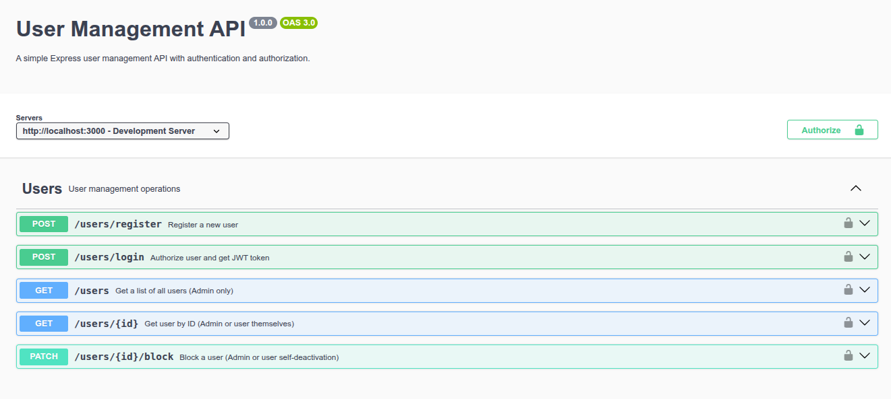

# Effective Mobile — тестовое задание

---
## Задание
### Нужно разработать сервис работы с пользователями. Модель пользователя должна содержать:  
    - ФИО
    - Дату рождения
    - Email - уникальное значение
    - Пароль
    - Роль - либо admin либо user
    - Статус пользователя - активный или нет


### Должны быть реализованы следующие endpoint:  
    1.  Регистрация пользователя  
    2.  Авторизация пользователя - любой механизм  
    3.  Получение пользователя по ID (Может получить либо админ либо пользователь сам себя)  
    4.  Получение списка пользователей - только для админа  
    5.  Блокировка пользователя - либо админ либо пользователь сам себя  
    Важно обратить внимание на организацию структуры проекта, применять лучшие
    практики.  

### Что использовать запрещено:
    - NestJS

### Что использовать можно:  
    - Express или koa
    - Любую СУБД
    - Любую ORM/ODM
    - Желательно работу выполнить на Typescript, но JS так же допускается

---
---

## Структура проекта

```
src/
├── controllers/        — обработчики маршрутов
├── models/             — модели TypeORM
├── repositories/       — работа с БД
├── routes/             — маршруты
├── middleware/         — middleware (JWT, авторизация)
├── types/              — типы TypeScript
├── utils/              — вспомогательные функции
├── validations/        — валидация Joi
├── swagger.ts          — настройка Swagger
├── data-source.ts      — настройка TypeORM
└── index.ts            — точка входа
```

## Установка

### Клонируйте репозиторий
```bash
git clone https://github.com/v-nvtsk/effective-mobile.git
cd effective-mobile
```

### Создайте файл `.env` с данными для подключения к БД

```
PORT=3000
DB_HOST=localhost
DB_PORT=5432
DB_USER=effective_mobile_db_user
DB_PASSWORD=effective_mobile_db!
DB_NAME=effective_mobile_db
JWT_SECRET=supersecretjwtkey
```

### Запуск сервера

```bash
npm run start
```

Сервер запустится на порту 3000. 

Swagger будет доступен по адресу [http://localhost:3000/api-docs/](http://localhost:3000/api-docs/).


